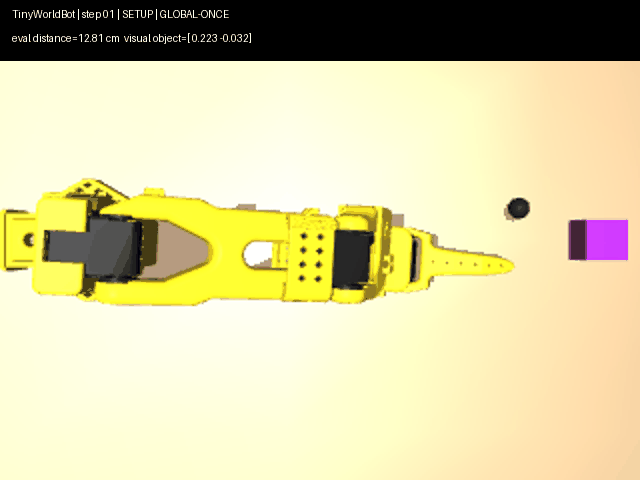
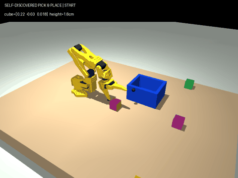

# TinyWorldBot

[English](README.md) | **中文**

**SO-101 能不能在没有遥操作示范数据的情况下，自己学到足够有用的接触动力学？**

TinyWorldBot 是一个基于 MuJoCo 的小型机器人研究项目，用 SO-101 机械臂测试一条不同于“遥操作采集数据”的路线：

**自主探索 + 小型 world model + MPC。**



当前 pushing 参考结果：

```text
1,600 次自主交互
0 条遥操作示范
测试物体外观未出现在训练中

12.81 cm  ->  3.92 cm
27 个控制步
成功阈值：< 4 cm
```

## v0.2：自恢复 Pick-and-Place

TinyWorldBot 现在增加了一条完整的物理抓取/搬运/放置链路，抓取 primitive 来自自主探索，而不是人工遥操作示范。



运行时流程：

```text
缓存的空桌面 RGB
-> 定位物体
-> 尝试一个自主发现的 grasp
-> 抬升
-> 回到固定姿态，用 wrist RGB 判断有没有抓住
-> 判断失败就松开、回 home、重新找物体、换下一个 grasp
-> 搬运
-> 用 object-in-gripper offset 修正放置点
-> 先让桌面承重
-> 慢速松爪
```

运行时选动作不读取 MuJoCo 的物体真实坐标或高度；simulator truth 只用于最后统计结果。

固定 physics、随机物体 XY、随机目标 XY、held-out 物体颜色的一组验证中，**16 次完整 pick-and-place 成功 9 次（56.2%）**。这个数字只是工程回归测试，不是统计意义上的机器人 benchmark。

更重要的是，换成随机质量、摩擦、尺寸、相机姿态和 actuator dynamics 后，固定冠军 grasp 会明显掉到约 25% place success。这个负结果被保留在文档里，因为它直接说明 sim-to-real gap 还很大。

完整方法、失败案例和复现实验见：[docs/pickplace.md](docs/pickplace.md)

## 为什么做这个项目

很多低成本机器人项目的典型流程是：

```text
遥操作 -> 录制示范 -> 训练策略 -> 执行策略
```

TinyWorldBot 想测试另一条更小、更直接的路线：

```text
自主探索 -> 学习局部动力学 -> 在模型里想象短期未来 -> 执行动作
```

它不是 foundation model，也不是在证明 MPC 可以替代模仿学习。

这个项目更像一个可复现的小型实验台：看看一个很小的 learned dynamics model，在接触式机器人操作里究竟能做到什么程度，以及它会在哪里失败。

## 当前流程

```text
俯视 RGB 相机只观察一次
        |
        v
current-vs-empty 差分
自动得到物体初始位置
不依赖固定颜色阈值
        |
        v
几何 setup
选择正确接触方向
        |
        v
侧偏安装的腕部相机
        |
        v
接触阶段持续跟踪物体
        |
        v
带短历史的 learned world model
        |
        v
沿目标方向约束的 residual CEM/MPC
```

俯视相机只在机械臂进入工作区之前使用一次。

这是有意设计的：在真正接触之前，目标物体本来就不应该自己移动。如果持续用俯视相机跟踪，机械臂进入画面后反而容易遮挡物体、干扰 tracker。

接近物体以后，视觉会切换到腕部相机。

仿真里我把 wrist camera 改成了一个略微侧偏的 eye-in-hand 安装方式，因为原始模型里的腕部相机在部分接触姿态下会被夹爪遮挡。

## 控制器看不到什么

在自主采集、训练和动作规划过程中：

- **不读取 MuJoCo 的物体真实 XY 坐标**
- **不使用 segmentation label**
- **不使用遥操作示范**
- **不写死目标物体颜色阈值**

MuJoCo 的物体真实 XY 只在实验结束后用于计算最终误差。

当前版本仍然有一些明确的先验条件：

- 固定桌面平面
- 一次相机标定
- 全局视觉初始化需要一张空场景参考图
- 目标 XY 已知
- 当前 benchmark 主要是简单方块
- 高层接触位置选择仍然使用几何规则

这些都是当前 baseline 的组成部分，不是隐藏条件。

## 快速开始

推荐 Python 3.10+。

CUDA GPU 会让 world model 训练和 CEM 规划快很多，但也支持 CPU。

```bash
git clone https://github.com/toyhank/tinyworldbot.git
cd tinyworldbot

python -m venv .venv

# Windows
.venv\Scripts\activate

# Linux / macOS
# source .venv/bin/activate

pip install -e .
python -m tinyworldbot.demo --samples 1600 --epochs 35

# v0.2 pick-and-place
python -m tinyworldbot.pickplace --trials 8 --seed 13579
```

如果只想快速确认 pushing 可以运行：

```bash
python -m tinyworldbot.demo --samples 300 --epochs 3 --device cpu
```

运行结束后会生成：

```text
outputs/demo.gif
```

## 方法

world model 使用的状态为：

```text
[EE_x, EE_y, object_x, object_y, joint_1 ... joint_5]
```

这里的 `object_x / object_y` 来自 RGB 视觉估计，而不是 MuJoCo 提供的物体真实坐标。

world model 的输入除了当前状态，还包括：

- 最近两次状态变化
- 当前动作
- 前两次动作

这样模型可以利用一点短期历史，去区分：

```text
还没接触
正在推
发生滑动
刚刚失去接触
```

同时模型里还有一个 learned contact gate，用来控制预测中的物体运动。

### 为什么不是直接让 CEM 搜任意 XY 动作

早期版本让 CEM 在任意二维动作空间里搜索，world model 很容易被优化器“钻漏洞”。

现在的规划空间被限制为：

```text
沿目标方向向前推
+
少量横向修正
```

也就是：

```text
forward push magnitude + lateral correction
```

在当前 SO-101 接触任务里，这比完全自由的 XY CEM 稳定很多。

## 失败实验也保留了

项目不是从第一版就成功的。

实验过程中试过：

| 方案 | 结果 | 主要问题 |
| --- | --- | --- |
| 纯 learned MPC | 不稳定 | optimizer 会利用 world model 误差 |
| contact-gated MPC | 有改善 | 仍然不擅长处理错误接触侧 |
| 只加 history model | 不稳定 | 接触拓扑和视觉问题还在 |
| KLT / CamShift 通用俯视跟踪 | 大约停在 6 cm | 接触时 tracker 容易粘到夹爪 |
| DINOv2 patch/template tracking | 精度不够 | 语义特征不适合毫米级接触定位 |
| 完美物体隔离的仿真 oracle | 可以成功 | 证明视觉是瓶颈，但不是真实可部署方案 |

最终比较稳定的组合是：

```text
一次全局定位
+
几何接触侧规划
+
腕部近距离视觉
+
短历史 world model
+
受约束的 CEM/MPC
```

更完整的实验记录见：

[docs/experiments.md](docs/experiments.md)

## 项目结构

```text
tinyworldbot/
  env.py          # SO-101 MuJoCo 环境 + IK
  vision.py       # 全局初始化视觉 + 腕部视觉跟踪
  world_model.py  # 带短历史的动力学模型
  planner.py      # setup controller + residual CEM/MPC
  demo.py         # pushing 的自主采集、训练、评估
  pickplace.py    # 自恢复 pick-and-place baseline
  assets/so101/   # MuJoCo 模型和 mesh

tests/
docs/
media/
```

## 当前结果应该怎么理解

pushing 的 headline result 是当前独立仓库的一次确定性参考运行：

```text
seed = 113
samples = 1600
epochs = 35

12.81 cm -> 3.92 cm
27 steps
```

这**不是**经过大量随机种子验证后的统计成功率。

pick-and-place 使用另外一批 held-out seed 做了小规模验证：

```bash
python -m tinyworldbot.pickplace --trials 8 --seed 13579
```

8 次这种小样本可能和 16 次验证的 56.2% 有明显波动，所以 README 不把某个短 batch 的最好数字当成“成功率”。

所以现在可以说：

> 在当前 MuJoCo 场景中，这条“自主交互 + 视觉状态 + 小型 world model + MPC”的链路可以完整跑通。

但还不能说：

> 它已经是一个可靠的通用机器人操作方法。

多随机种子测试、不同物体、不同相机位置和真实 SO-101，才是更重要的下一步。

## 下一步

比继续把仿真的 3.92 cm 调到 3 cm 更有价值的方向是：

- 真机 SO-101
- 真实腕部摄像头安装
- 真实相机外参标定
- 不同形状、材质和尺寸的物体
- 用 mask tracker 替代 appearance tracker
- 随机光照和相机扰动
- 与纯手写 pushing controller 做 ablation
- 与 behavior cloning / imitation learning 比较数据效率
- 尝试跨机器人 embodiment transfer

如果真实 SO-101 也能做到：

```text
不接 leader arm
不录人工示范
机器人自己探索十几到几十分钟
然后能把物体推到视觉目标
```

这个项目的意义会比目前的纯仿真结果大很多。

## 第三方资产

SO-101 MuJoCo 模型及 mesh 资产保留了原始 Apache-2.0 许可证和 attribution。

详情见：

[THIRD_PARTY_NOTICES.md](THIRD_PARTY_NOTICES.md)

当前仓库尚未为项目原创 Python 代码声明统一的开源许可证。
